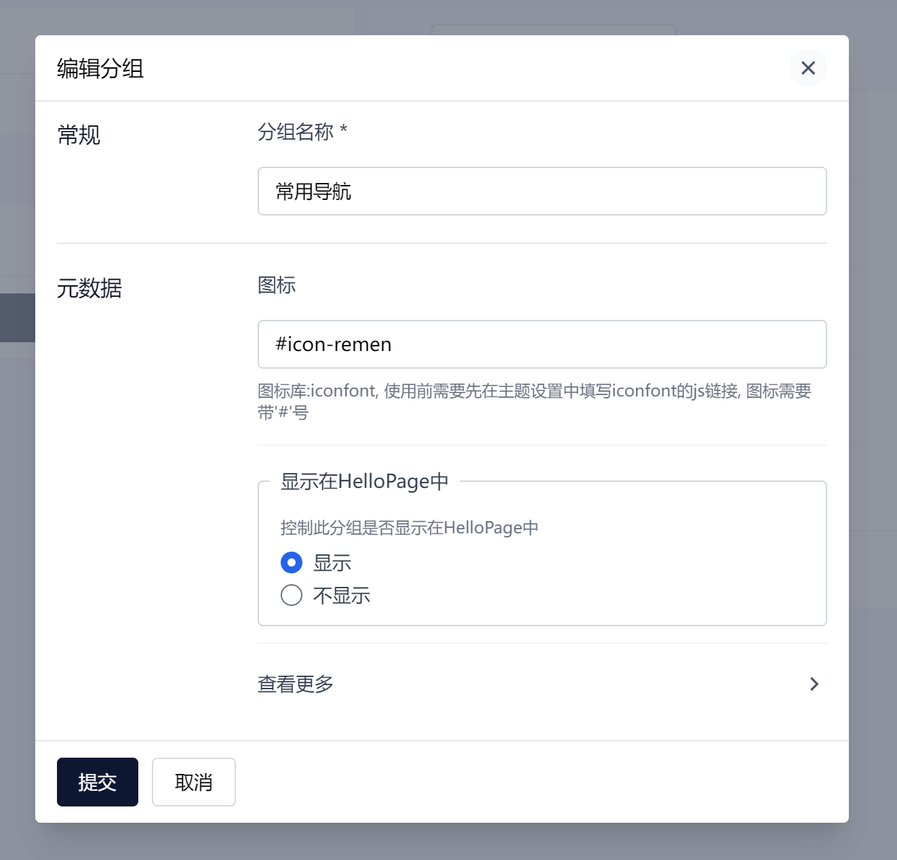
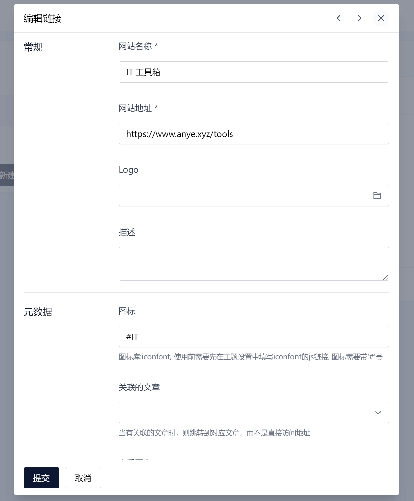

# Theme HelloPage

HelloPage 是一款简洁的导航页主题，适用于 Halo 系统，可用于快捷搭建一个导航站。

移植于 [5IUX搜索 - 导航版](https://sou.5iux.cn/)

## 预览

[预览地址](https://www.anye.xyz/hello)

## 特性

此主题需要安装 Halo 的官方插件 **[链接管理](https://www.halo.run/store/apps/app-hfbQg)** 然后进行操作。

> 本主题适合作为副主题使用, 不包含文章相关模板的实现, 安装并填写主题相关配置后，可以在站点地址后加上 `?preview-theme=theme-hellopage` 来访问。 无需启用本主题，因此不会影响到您现在所使用的主题。

### 自定义分组图标、控制分组显示、链接关联文章：

## 致谢

- [Halo](https://halo.run/)
- [5IUX搜索 - 导航版](https://sou.5iux.cn/)
- [六零导航页](https://hao.lylme.com/)
- [Ryan Wang](https://ryanc.cc/)
- [张洪Heo](https://github.com/zhheo)
- [困困鱼](https://github.com/chengzhongxue)

## 欢迎关注

- [个人博客](https://www.anye.xyz/)
- [水滴基地](https://www.sdbase.cn/)
